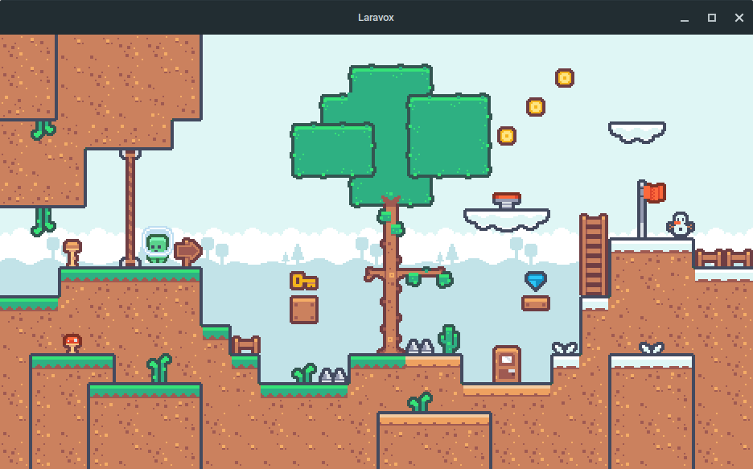

# Laravox
A 2D game development framework, written in Rust.

  

## Usage
Download the latest release from [here](https://github.com/luxreduxdelux/laravox/releases) and launch Laravox.

## Documentation
The Rune API documentation can be found [here](TO-DO).

## Build
Run `cargo build --release` in the root of the Laravox folder.

## License
Laravox has a BSD-2-Clause-Patent license.